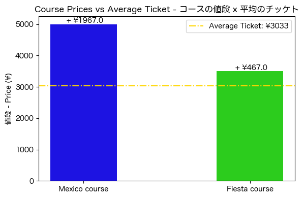
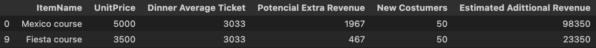
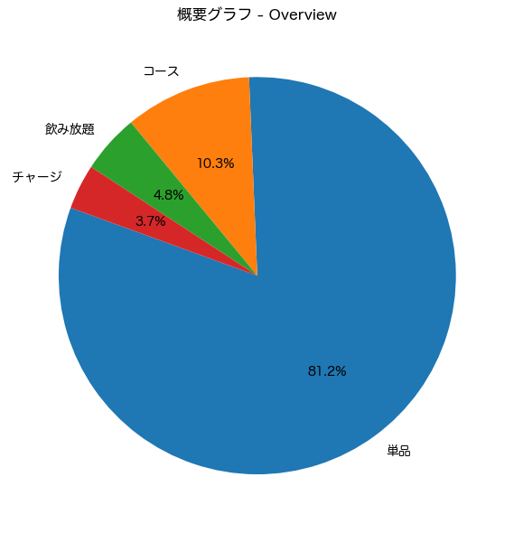

# Discoveries in a restaurant in Tokyo: What the consumption data reveals 
## 日本語の要約はページ下部にあります。
## How do different order formats (individual items, set courses and nomihoudai plans) impact revenue, customer behavior and menu strategy? 
Based on real sales data and in-store experience, this project uses structured analysis to identify insights, patterns, customer behavior, and actionable strategies to increase profitability.

Tech Stack: Python (Pandas, Matplotlib, Seaborn)・Jupyter Notebook・GitHub
## Key Results
- 33% of products generate 80% of sales
- 76 low performing products identified as potential removals to simplify the menu
- Courses unlock additional revenue: F Course +15% and M Course +64% compared to the regular dinner ticket
- Nomihoudai reveals customer preferences
## Thinking Through Data
The environment is rich: customers can order individual items, pick a set-course menu, or choose from different types of nomihoudai plans.
At first glance, it's just variety, but behind it I saw a question worth exploring: 
How does business performance shift when we analyze it strategically.

To explore these, I divided the dataset into three groups and created decision-oriented tools: a matrix, a pareto chart, an attraction index and simulations tied to real scenarios.
The project reflects not only what I found, but how I think: with structure, curiosity about behavior, and focus on turning data into real business action.
The kind of thinking I can bring to any strategy-driven team.

[For the full process, including all visualizations and step-by-step, click here](https://github.com/aldo-222/Restaurant-Data-Analysis-Tokyo/blob/main/notebooks/final_integrated_version.ipynb)
## 1. Individual Products - 単品
### タコス: レストランにおける売上の中心軸
### Tacos: The commercial axis in the restaurant

Tacos are the top-selling individual product, both at lunch and dinner, in terms of units sold and total revenue. Quesadillas and burritos follow in third and fourth place, respectively. This data will be visualized in the next graph to identify relationships.
### 単品の33%が売上の80%を占めている
### 33% of the products account for 80% sales  

If we rank products by sales performance (from highest to lowest), we will find that the top 33% account for 80% of sales.
A clear strategy is to push the sales of the top 5, so we can bias to get the 20% - 80% relation.
What about the rest of the products? Let's take a look:
### 76単品が削除対象のリスクあり・赤い点
### 76 Products at risk of removal (red dots)

Sales Amount vs Units Sold Matrix(log scale)  
The matrix shows 4 classifications 
View full notebook with all visualizations [here](https://github.com/aldo-222/Restaurant-Data-Analysis-Tokyo/blob/main/notebooks/final_integrated_version.ipynb))  
The red ones represent products that we could remove to make the menu lighter.
## 2. Nomihoudai - 飲み放題 
### 飲み放題で人気のある飲み物がわかるインデックス
### An Index that shows the customer's perception under Noumihoudai options

Finding relations between individual drinks and nomihoudai options: Under nomihoudai options (unlimited drinks in two hours), the perceived value of Sparkling Wine, Red Wine and Lemon Sour increases significantly. Corona and HighBall show more balanced consumption across menus, while Cola or Orange Juice are more frequently chosen in individual drinks.
This points to emphasizing the first two in the nomihoudai menus.
However, if we want to see each group by itself, we can divide it into: 
### ビールはすべての選びで一番人気の飲み物
### Beer as the top drink in every option (individual, nomihoudai and premium)
We can divide into: [Top Nomihoudai](https://github.com/aldo-222/Restaurant-Data-Analysis-Tokyo/blob/main/images/heat_nomihoudai.png) / [Top Premium Nomihoudai](https://github.com/aldo-222/Restaurant-Data-Analysis-Tokyo/blob/main/images/heat_premium.png) / [Top Individual Drinks](https://github.com/aldo-222/Restaurant-Data-Analysis-Tokyo/blob/main/images/heat_individual.png)

In each of them, beer is on the top (Corona and Asahi). 
This leads to expanding beer options: adding more variety (IPA, craft beer, Bohemia) to the nomihoudai menu and using premium beer as a differentiator in premium nomihoudai.
## 3. Course - コース
### コース選択の収益は？
### How much revenue do we get when customers choose a course?

By comparing the dinner average ticket with the prices of the two courses (Mexico and Fiesta) we can see that: 
- A customer choosing the Mexico Course brings in ￥1,976 more than ordering individually.
- For the Fiesta Course, the difference is ￥467

This confirms that the courses are profitable
If 50 customers switched from regular dinner orders to one of the courses, the additional revenue would be:

There's a clear opportunity here to promote courses through staff suggestions or by offering free desserts.

## Final: Where We Are, and Where We Could Go
## まとめる: 現在の状態と未来の状態

Today, over 80% of the restaurant's revenue comes from individual products (dinner, lunch and drinks). But that's exactly why the smaller formats (courses and nomihoudai) stand out: They hold real potential for growth, this is:
- Nomihoudai doesn't just generate steady revenue, reveals customer preferences.
- Courses unlock additional revenue that wouldn't happen with individual orders.  

They may represent under 20% of revenue today, but courses and nomihoudai show real potential: They raise spend, shift behavior, and open new design space, it's time to grow them, as levers.

## 日本語要約

このプロジェクトは、私が東京のレストランで働いていたときの経験と、実際の売上データを使って作りました。
仕事の中で、注文のスタイルによって、お客様の行動やお店の売上が変わることに気づきました。
そこで「単品」「飲み放題」「コース」という三つのスタイルに分けて、それぞれの売上や特徴を調べました。

下のグラフは、売上がどの商品カテゴリから生まれているかを示しています

- 売上の80%以上は「ランチ」「デイなー」「ドリンク」などの単品注文からです。
- 飲み放題は、いつも安定した売上があり、さらに、お客様の好みもわかります。
- コース料理は、単品注文ではな追加の売上を作ることができます。  

このように、注文のスタイルを見ることで、もっと良いビジネスの作り方を考えることができます。
このプロジェクトでは、データと現場での経験を合わせて、わかりやすくまとめることを目指しました。
分析コードは以下から見られます:[コード](https://github.com/aldo-222/Restaurant-Data-Analysis-Tokyo/blob/main/notebooks/final_integrated_version.ipynb)
すべてのステップに日本語の説明も書いてあります。
