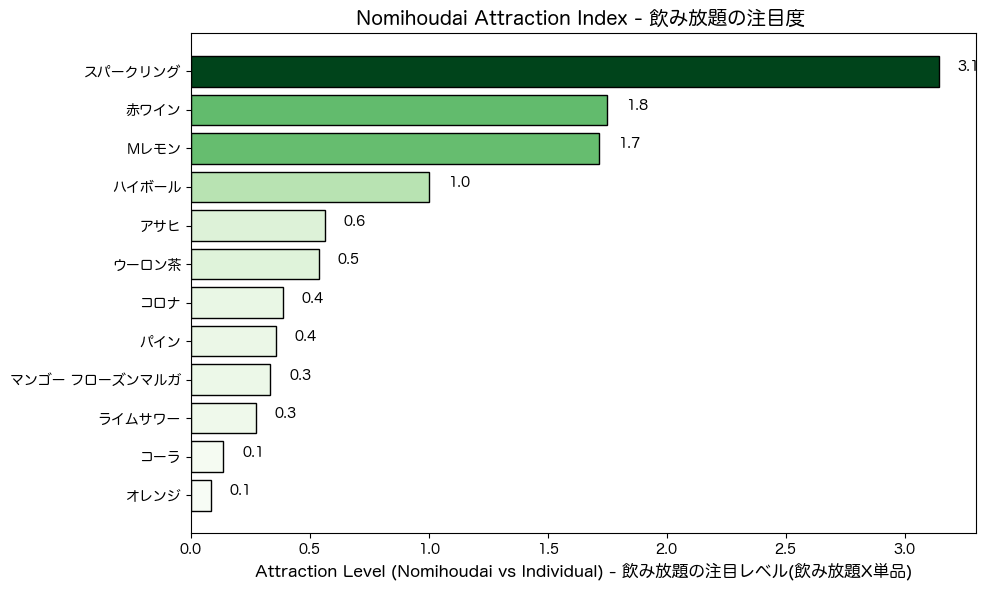

# Discoveries in a restaurant in Tokyo: What the consumption data reveals 
## Based on real sales data and in-store experience, this project uses structured analysis to identify insights, patterns, customer behavior, and actionable strategies to increase profitability.
## Thinking Through Data
The environment is rich: customers can order individual items, pick a set-course menu, or choose from different types of nomihoudai plans.
At first glance, it's just variety, but behind I saw a question worth exploring: 
How does business performance shift when we analyze it strategically.
What I wanted to understand: 
- What truly holds up the business (economic contribution)
- What hidden customer behaviors emerge when pricing structures change (nomihoudai)
- Do set courses really help the business, or are they just a comftable option?
- And how to segment products in a way that drives action
To explore these, I divided the dataset into three groups and created decision-oriented tools: a matrix, a pareto chart, an attraction index and simulations tied to real scenarios.
The project reflects not only what I found, but how I think: with structure, curiosity about behavior, and focus on turning data into real business action.
The kind of thinking I can bring to any strategy-driven team.

For the full process, including all visualizations and step-by-step, clik [here](https://github.com/aldo-222/Restaurant-Data-Analysis-Tokyo/blob/main/notebooks/final_integrated_version.ipynb)
## 1. Individual Products - 単品
### Tacos: The commercial axis in the restaurant

Tacos are the top-selling individual product, both at lunch and dinner, in terms of units sold and total revenue. Quesadillas and burritos follow in third and fourth place, respectively. This data will be visualized in the next graph to identify relationhips.
### 33% of the products account for 80% sales

If we rank products by sales performance (from highest to lowest), we will find that the top 33% account for 80% of sales.
A clear strategy is to push the sales of the top 5, so we can bias to get the 20% - 80% relation.
What about the rest of the products? Let's take a look:
### 76 Products at risk of removal (red dots)

Sales Amount vs Units Sold Matrix(log scale)
The matrix shows 4 classifications 
View full notebook with all visualizations [here](https://github.com/aldo-222/Restaurant-Data-Analysis-Tokyo/blob/main/notebooks/final_integrated_version.ipynb)) 
The red ones represent products that we could remove to make the menu lighter.
## 2. Nomihoudai - 飲み放題 
### An Index that shows the customer's perception under noumihoudai options

Finding relations between individual drinks and nomihoudai options: Under nomihoudai options (unlimited drinks in two hours), the perceived value of Sparkling Wine, Red Wine and Lemon Sour raises significantly. Corona and HighBall show more balanced consumption across menus, while Cola or Orange Juice are more frequently chosen in individual drinks.
This points to emphasizing the first two in the nomihoudai menus.
However, if we want to see each group by itself, we can break as: 
### Beer as the top drink in every option (individual, nomihoudai and premium)
[Top Nomihoudai](https://github.com/aldo-222/Restaurant-Data-Analysis-Tokyo/blob/main/images/heat_nomihoudai.png) / [Top Premium Nomihoudai](https://github.com/aldo-222/Restaurant-Data-Analysis-Tokyo/blob/main/images/heat_premium.png) / [Top Individual Drinks](https://github.com/aldo-222/Restaurant-Data-Analysis-Tokyo/blob/main/images/heat_individual.png)
In each of them, beer is on the top (Corona and Asahi). 
This leads to expanding beer options: adding more variety (IPA, craft beer, Bohemia) to the nomihoudai menu and using premium beer as a differentior in premium nomihoudai.
## 3. Course - コース
### How much revenue do we get when customers choose a course?

By comparing the dinner average ticket with the prices of the two courses (Mexico and Fiesta) we can see that: 
- A customer choosing the Mexico Course brings in ￥1,976 more than ordering individually.
- For the Fiesta Course, the difference is ￥467

This confirms that the courses are profitable
If 50 customers switched from regular dinner orders to one of the courses, the additional revenue would be:

There's a clear opportunity here to promote courses through staff suggestions or by offering free desserts.

Para ver el código completo, revisar la versión final en el preview 
