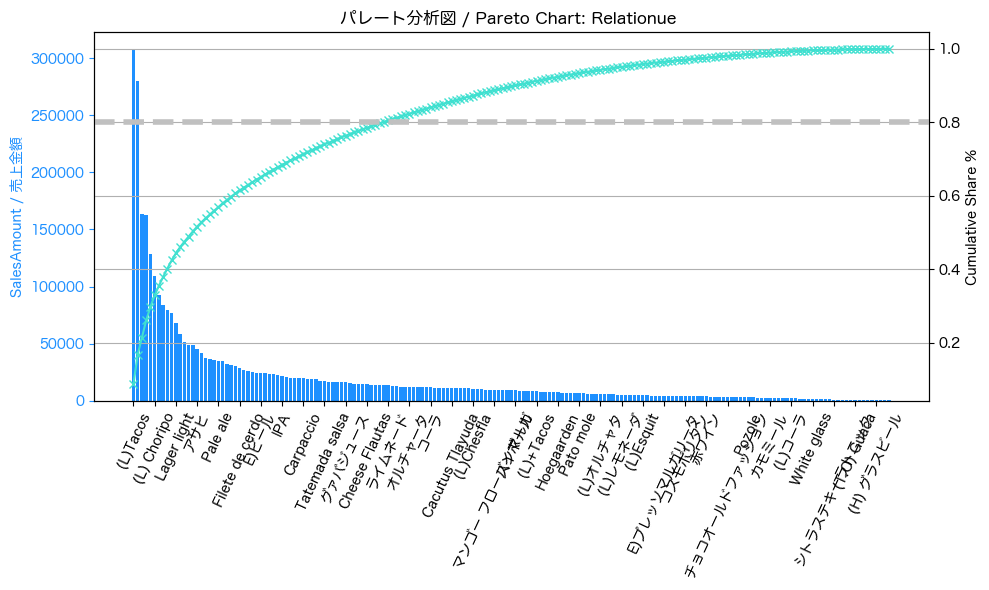

# Discoveries in a restaurant in Tokyo: What the consumption data reveals 
## Summary
### Hallazgos
## Individual Products - 単品
### Tacos: The commercial axis in the restaurant

Tacos are the top-selling individual product, both at lunch and dinner, in terms of units sold and total revenue. Quesadillas and burritos follow in third and fourth place, respectively. This data will be visualized in the next graph to identify relationhips.
### 33% of the products account for 80% sales

If we rank products by sales performance (from highest to lowest), we will find that the top 33% account for 80% of sales.
A clear strategy is to push the sales of the top 5, so we can bias to get the 20% - 80% relation.
What about the rest of the products? Let's take a look:
### 76 Products at risk of removal (red dots)
Sales Amount vs Units Sold Matrix(log)

The matrix shows 4 classifications (please open the preview for more details: [code](https://github.com/aldo-222/Restaurant-Data-Analysis-Tokyo/blob/main/notebooks/final_integrated_version.ipynb)) the red ones represent products that we could remove to make the menu lighter.
## Nomihoudai - 飲み放題 
### An Index that shows the customer's perception

Ya sea en alguno de los dos nomihoudai o en el consumo regular, este índice revela cuales son las bebidas más 
[Top Nomihoudai](https://github.com/aldo-222/Restaurant-Data-Analysis-Tokyo/blob/main/images/heat_nomihoudai.png)
[Top Premium Nomihoudai](https://github.com/aldo-222/Restaurant-Data-Analysis-Tokyo/blob/main/images/heat_premium.png)
[Top Individual Drinks](https://github.com/aldo-222/Restaurant-Data-Analysis-Tokyo/blob/main/images/heat_individual.png)
## Course - コース
Para ver el código completo, revisar la versión final en el preview 
